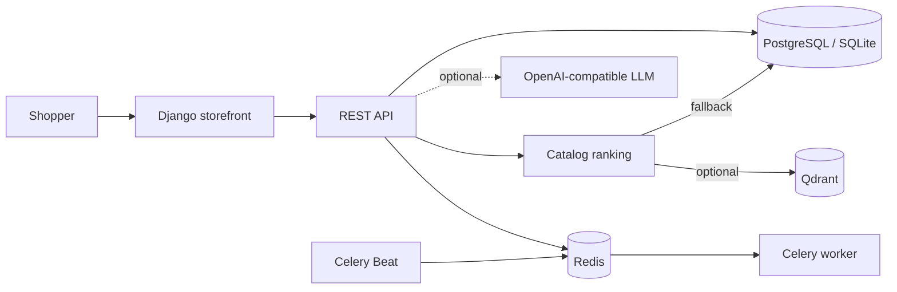

# Riva_ai_shop

**AI-assisted hardware shopping built with Django.** Browse a seeded PC parts catalog, compare products, get catalog-grounded recommendations, manage a shopping bag, and explore account, support, and API workflows.

[](https://www.python.org/downloads/release/python-3110/)
[](https://www.djangoproject.com/)
[](https://www.postgresql.org/)
[](https://docs.docker.com/compose/)
[](https://docs.celeryq.dev/)
[](https://redis.io/)
[](LICENSE)
[](https://github.com/Mhdjamadi1994/Riva_ai_shop/actions/workflows/ci.yml)

> **Live demo:** A public instance is not online yet. The Render button below starts a deployment in your Render account; it does not open a running store. Once a deployment is live and verified, replace this notice with its public URL.

[](https://render.com/deploy?repo=https%3A%2F%2Fgithub.com%2FMhdjamadi1994%2FRiva_ai_shop)

## Product tour

Screenshots are grouped by the customer journey. Select an image to view it at full size.

### Storefront

| Home and navigation | Shopping discovery |
|:---:|:---:|
| [](docs/screenshots/homepage-hero.jpg)<br>**Home page** — Featured hardware, primary navigation, and entry points to the catalog and assistant. | [](docs/screenshots/home-shopping-discovery.jpg)<br>**Discovery** — Editorial product discovery and guided shopping sections. |

### Catalog and product discovery

| Graphics cards | Laptops |
|:---:|:---:|
| [](docs/screenshots/catalog-graphics-cards.jpg)<br>**Graphics catalog** — Category browsing, search, filters, stock indicators, and product cards. | [](docs/screenshots/catalog-laptops.jpg)<br>**Laptop catalog** — Product listings with category and price discovery. |

### AI shopping and checkout

| AI product finder | Shopping bag |
|:---:|:---:|
| [](docs/screenshots/ai-product-finder.jpg)<br>**Product finder** — Describe a use case or budget and ask Riva to find relevant catalog items. | [](docs/screenshots/shopping-bag.jpg)<br>**Shopping bag** — Review selected products and quantities before the simulated checkout flow. |

### Accounts and support

| Sign in and registration | Support center |
|:---:|:---:|
| [](docs/screenshots/sign-in-and-registration.jpg)<br>**Account access** — Sign in or create an account for account-backed chat and checkout. | [](docs/screenshots/support-center-preview.jpg)<br>**Support** — Submit and track support requests; staff review assistant-generated drafts. |

### Storefront footer

[](docs/screenshots/home-page-footer.jpg)

The footer links to API documentation and other site sections. Screenshots use sample product data. No personal account or customer data is included.

## What Riva does

- **Storefront:** hardware catalog, category and text search, product details, shopping bag, account pages, and customer support.
- **Product recommendations:** budget- and stock-aware ranking; optional vector retrieval through Qdrant, with database search fallback.
- **Shopping assistant:** conversation context and relevant catalog excerpts sent to an optional OpenAI-compatible LLM. Without provider credentials, a clearly identified catalog fallback is used.
- **Commerce workflows:** inventory reservation, order creation, checkout state, payment-provider integration hooks, and signed webhook verification.
- **Operations:** Django administration, health endpoint, Celery tasks, staff reports, support review, and backup/restore commands.

### Request flow

1. A shopper browses the catalog or sends a product question.
2. Riva validates the request and applies category, stock, and budget constraints.
3. Product retrieval uses configured embeddings and Qdrant when available, or database search otherwise.
4. The optional language model receives recent conversation context and selected catalog excerpts; catalog text is treated as untrusted input.
5. Riva returns product-linked guidance. Orders and account data remain in the relational database.

## Architecture



| Component | Responsibility |
|---|---|
| `apps/storefront/` | Customer pages, templates, static UI, and storefront APIs |
| `apps/products/` | Product, inventory, and order domain |
| `apps/chatbot/` | Assistant API, provider integration, and input checks |
| `apps/recommendation/` | Product ranking and retrieval tracking |
| `apps/core/` | Accounts, payments, exchange rates, and shared services |
| `apps/agents/` | Background jobs, staff reports, and backup workflows |
| `config/` | Django, URL routing, and Celery configuration |

## Run the interactive demo locally

Docker Compose starts the storefront, PostgreSQL, Redis, Qdrant, and Celery services.

```bash
git clone https://github.com/Mhdjamadi1994/Riva_ai_shop.git
cd Riva_ai_shop
cp .env.example .env
docker compose up --build
```

Open **http://localhost:8011**. Seed the sample catalog from another terminal:

```bash
docker compose exec web python manage.py seed_demo_catalog
```

On Windows PowerShell, create the environment file with `Copy-Item .env.example .env`; in Command Prompt use `copy .env.example .env`.

The demo checkout is simulated: it does not request card details or charge money. For local setup without Docker, install Python 3.11, then run `python -m pip install -e .`, `python manage.py migrate`, `python manage.py seed_demo_catalog`, and `python manage.py runserver`.

## APIs and integrations

- **API schema:** `/api/schema/`
- **Swagger UI:** `/api/docs/`
- **ReDoc:** `/api/redoc/`
- **Health:** `/api/health/`
- Optional services: OpenAI-compatible chat/embeddings, Qdrant, Stripe, SMTP, Telegram, and object storage for backups.

The chat API requires an authenticated conversation. The product recommendation API can be used independently of the language model. See [API routing](config/urls.py) and the generated schema for endpoint permissions and payloads.

## Deployment

[`render.yaml`](render.yaml) describes the hosted demo stack. Review its service plans and pricing in Render before deployment. It enables a no-card simulated checkout; AI responses use the catalog fallback until an LLM provider is configured. The deployment guide lists environment settings and acceptance checks: [Demo deployment](docs/DEMO_DEPLOYMENT.md).

## Security and privacy

- Never commit `.env`, provider keys, database dumps, backup archives, or customer data.
- Mock checkout is disabled by default outside development and must be explicitly enabled for a disposable demo.
- Riva application code does not infer or store shopper location from IP addresses. Hosting and network providers may still process connection IPs in infrastructure logs.
- Review data retention, staff access, payment configuration, and hosting logs before opening an instance to the public.

## Development checks

```bash
python manage.py check
python manage.py test --noinput
docker compose config --quiet
```

GitHub Actions runs the test suite against SQLite and PostgreSQL and builds the Docker image. See [workflow runs](https://github.com/Mhdjamadi1994/Riva_ai_shop/actions).

## License

Released under the [MIT License](LICENSE).
