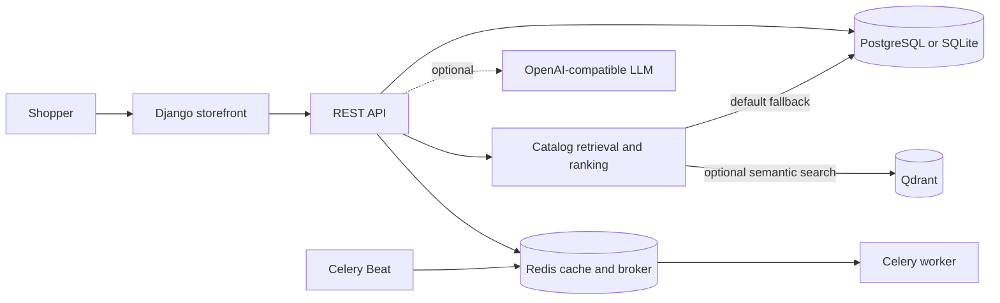

# Riva_ai_shop

**An AI-assisted PC hardware storefront built with Django.** Riva helps shoppers explore a hardware catalog, compare options, get product-linked recommendations, and use account, bag, checkout, and support workflows.

[](https://www.python.org/downloads/release/python-3110/)
[](https://www.djangoproject.com/)
[](https://www.postgresql.org/)
[](https://redis.io/)
[](https://docs.celeryq.dev/)
[](https://docs.docker.com/compose/)
[](LICENSE)
[](https://github.com/Mhdjamadi1994/Riva_ai_shop/actions/workflows/ci.yml)

## Contents

- [Product tour](#product-tour)
- [Capabilities](#capabilities)
- [Recommendation flow](#recommendation-flow)
- [Architecture](#architecture)
- [Technology stack](#technology-stack)
- [Run locally](#run-locally)
- [API surface](#api-surface)
- [Configuration and integrations](#configuration-and-integrations)
- [Security and privacy](#security-and-privacy)
- [Development checks](#development-checks)
- [License](#license)

## Product tour

Screenshots use sample storefront data. Related views are paired; select any image to view it at full size.

### Storefront and catalog

| Home | Product discovery |
|:---:|:---:|
| [](docs/screenshots/homepage-hero.jpg)<br>**Storefront home** — Navigation, hardware-focused hero, and entry points to shopping and assistance. | [](docs/screenshots/home-shopping-discovery.jpg)<br>**Shopping discovery** — Curated sections that guide shoppers into the catalog. |

| Graphics cards | Laptops |
|:---:|:---:|
| [](docs/screenshots/catalog-graphics-cards.jpg)<br>**Graphics catalog** — Category-focused browsing and product cards. | [](docs/screenshots/catalog-laptops.jpg)<br>**Laptop catalog** — Browse listings and compare available hardware. |

### Assistant, bag, and support

| Product finder | Shopping bag |
|:---:|:---:|
| [](docs/screenshots/ai-product-finder.jpg)<br>**Product finder** — Describe a use case or budget for catalog-linked suggestions. | [](docs/screenshots/shopping-bag.jpg)<br>**Bag and checkout** — Review chosen products before simulated payment. |

| Account access | Support |
|:---:|:---:|
| [](docs/screenshots/sign-in-and-registration.jpg)<br>**Account access** — Sign in or create an account for account-backed workflows. | [](docs/screenshots/support-center-preview.jpg)<br>**Support center** — Submit and track support requests. |

[](docs/screenshots/home-page-footer.jpg)

The footer links to additional storefront sections and API resources. Screenshots contain no personal account or customer data.

## Capabilities

- **Hardware storefront:** browse categories, search and filter products, inspect details, and view availability.
- **Catalog recommendations:** rank products by shopper intent, budget, category, and stock. Database keyword matching is available by default; semantic retrieval is optional.
- **Conversational shopping assistant:** compose product-linked responses from catalog records. An OpenAI-compatible LLM can be configured; without provider credentials, Riva uses its catalog fallback.
- **Customer workflows:** registration, account views, bag management, order creation, inventory reservation, simulated checkout, and support tickets.
- **Payment integration boundary:** provider hooks and signed webhook handling. Local checkout is simulated and never requests card details or charges a payment.
- **Operations:** Django administration, health checks, staff reports, Celery jobs, and database backup/restore commands.

### Application map

| Application | Responsibility |
|---|---|
| `apps/storefront/` | Customer pages, templates, static interface, and storefront API |
| `apps/products/` | Catalog, inventory movements, orders, checkout, and product engagement |
| `apps/chatbot/` | Assistant conversations, provider integration, and request validation |
| `apps/recommendation/` | Recommendation ranking, retrieval mode, and interaction tracking |
| `apps/core/` | Customer records, payment and exchange-rate services, and shared functions |
| `apps/agents/` | Background tasks, administrative reports, and backup workflows |
| `config/` | Django settings, URL routing, and Celery setup |

## Recommendation flow

1. Riva validates the request and extracts supported product intent.
2. It searches the catalog and ranks matches using category, budget, and availability signals.
3. When configured, embeddings and Qdrant provide semantic retrieval; otherwise, database keyword matching is used.
4. If an LLM provider is configured, it receives selected catalog excerpts and recent conversation context to compose a response.
5. The response links to relevant products. Recommendation runs and shopper interactions can be recorded.

Catalog descriptions are treated as untrusted input. Recommendations depend on catalog and inventory data and do not guarantee compatibility or availability.

## Architecture



## Technology stack

| Layer | Technology | Responsibility |
|---|---|---|
| Web | Python 3.11, Django 5.2 | Storefront, business logic, and administration |
| API | Django REST Framework, SimpleJWT, drf-spectacular | REST endpoints, token authentication, and OpenAPI |
| Relational data | PostgreSQL 16; SQLite for lightweight local development | Products, accounts, inventory, recommendations, and orders |
| Cache and task queue | Redis 7, Celery 5.6 | Cache, asynchronous jobs, and scheduled work |
| Optional semantic search | Qdrant and an embeddings provider | Vector-based catalog retrieval |
| Runtime and static assets | Docker Compose, Gunicorn, WhiteNoise | Local services and static-file delivery |
| Automation | GitHub Actions | Django checks, SQLite/PostgreSQL test jobs, and image build |

## Run locally

Docker Compose is the recommended way to explore the full local stack: Django, PostgreSQL, Redis, Qdrant, a Celery worker, and Celery Beat.

```bash
git clone https://github.com/Mhdjamadi1994/Riva_ai_shop.git
cd Riva_ai_shop
```

Create the environment file:

```bash
# macOS / Linux
cp .env.example .env
```

```powershell
# Windows PowerShell
Copy-Item .env.example .env
```

```bat
:: Windows Command Prompt
copy .env.example .env
```

Start the services and add the sample catalog:

```bash
docker compose up --build -d
docker compose exec web python manage.py seed_demo_catalog
```

Open **http://localhost:8011**. Checkout is simulated; it does not collect card data or make real charges.

### Python-only development

Python 3.11 is required. This mode uses SQLite and Django's development server. It does not start Redis-backed caching, the Celery worker, or Celery Beat.

Create `.env` using one of the platform-specific commands above before starting. The example file selects local development settings and SQLite.

```bash
python -m venv .venv
```

Activate the virtual environment, then install the package in editable mode and initialize the database:

```bash
# macOS / Linux
source .venv/bin/activate
python -m pip install -e .
python manage.py migrate
python manage.py seed_demo_catalog
python manage.py runserver
```

```powershell
# Windows PowerShell
.venv\Scripts\Activate.ps1
python -m pip install -e .
python manage.py migrate
python manage.py seed_demo_catalog
python manage.py runserver
```

The development server is available at **http://127.0.0.1:8000**. The package metadata name is `Riva_ai`; install it from this repository with `python -m pip install -e .`.

## API surface

The OpenAPI schema and interactive API references are available from a running local instance.

| Endpoint | Purpose |
|---|---|
| `/api/schema/` | OpenAPI schema |
| `/api/docs/` | Swagger UI |
| `/api/redoc/` | ReDoc |
| `/api/health/` | Database, Redis, and optional semantic-search health |
| `/api/storefront/products/` | Public storefront product listing |
| `/api/products/` | Product API |
| `/api/recommendations/` | Product recommendation API |
| `/api/chat/message/` | Authenticated assistant conversation |
| `/api/token/` | JWT token pair |

Authenticated permissions are the API default. Public storefront and recommendation endpoints define their own access rules. Consult the schema and URL configuration for payloads, throttling, and permissions.

## Configuration and integrations

Settings are loaded from environment variables; `.env.example` documents local defaults. Optional integrations include:

- **LLM and embeddings:** enable generated assistant responses and semantic retrieval. Keyword catalog matching remains available without them.
- **Qdrant:** provides vector search when the endpoint and embedding settings are complete.
- **Payments:** local checkout is simulated. Configure and review a real provider before accepting payments.
- **Email and Telegram:** configure credentials and webhook settings to enable delivery or bot integration.
- **Backups:** local backup and restore workflows are available; object storage can be configured for off-machine retention.

Keep live credentials in the runtime environment's secret manager. Never commit them or include them in screenshots.

## Security and privacy

- Do not commit `.env` files, provider keys, database dumps, backup archives, or customer data.
- Simulated checkout is for development and demonstration only; it is not a payment processor.
- Riva application code does not infer or store shopper location from IP addresses. Hosting and network providers may still process connection IPs in infrastructure logs.
- Before exposing an instance publicly, review `ALLOWED_HOSTS`, HTTPS, CSRF trusted origins, staff access, data retention, and provider logging.
- Use synthetic accounts and product data for screenshots.

## Development checks

Run these commands from the repository root:

```bash
python manage.py check
python manage.py collectstatic --noinput
python manage.py test --noinput
docker compose config --quiet
```

GitHub Actions validates Django against SQLite and PostgreSQL and builds the application image. See [GitHub Actions](https://github.com/Mhdjamadi1994/Riva_ai_shop/actions) for workflow results.

## License

Riva_ai_shop is released under the [MIT License](LICENSE).
