# Riva AI - Intelligent Hardware Shopping

[](https://www.python.org/downloads/release/python-3110/)
[](https://www.djangoproject.com/)
[](https://www.docker.com/)
[](https://www.postgresql.org/)
[](https://docs.celeryq.dev/)
[](https://redis.io/)
[](https://github.com/Mhdjamadi1994/Riva_ai_shop/blob/main/LICENSE)
[](https://github.com/Mhdjamadi1994/Riva_ai_shop/actions/workflows/ci.yml)

**Repository:** [Mhdjamadi1994/Riva_ai_shop](https://github.com/Mhdjamadi1994/Riva_ai_shop) | [Issues](https://github.com/Mhdjamadi1994/Riva_ai_shop/issues) | [Releases](https://github.com/Mhdjamadi1994/Riva_ai_shop/releases) | [Source tree](https://github.com/Mhdjamadi1994/Riva_ai_shop/tree/main)

## Contents

- [Screenshots](#screenshots-from-the-running-storefront)
- [Product tour](#product-tour)
- [Capabilities and assistant workflow](#capabilities)
- [Architecture and technology](#architecture)
- [Repository map](#repository-map)
- [Run locally](#run-locally)
- [Install as `Riva_ai`](#install-by-distribution-name)
- [API overview](#api-overview)
- [Deployment and public demo](#deployment-and-public-demo)
- [Demo deployment checklist](docs/DEMO_DEPLOYMENT.md)
- [Security and publication checklist](#security-and-publication-checklist)
- [License](#license)


Riva is a full-stack commerce and AI-assistance project for discovering computer hardware, comparing product options, and getting guided recommendations. It combines a Django storefront, documented REST APIs, catalog-aware chat, recommendation tracking, account and support workflows, payment integration points, and staff operations in one application.

> **Live demo:** Not deployed yet. The repository now includes a complete Render Blueprint and a one-click deployment flow. Review the included service plans and current [hosting costs](https://render.com/pricing) before deploying; the Blueprint uses paid web, worker, database, and queue services so asynchronous features and persistent data remain available. See [free-tier limitations](https://render.com/docs/free). After the public deployment passes its checks, replace this status with its real HTTPS URL.

[](https://render.com/deploy?repo=https%3A%2F%2Fgithub.com%2FMhdjamadi1994%2FRiva_ai_shop)

The deploy button provisions the services described in [`render.yaml`](render.yaml). It launches a demo sandbox: checkout is simulated and never charges a card; the assistant uses an explicit catalog-based fallback until you configure an AI provider key in the host's secret manager.

## Screenshots from the running storefront

The gallery below contains real screenshots captured from the running Riva storefront. It shows signed-out browsing, account access, catalog discovery, shopping assistance, the cart, and support. Product names and prices are seeded demonstration data.

<table>
  <tr>
    <td width="50%"><a href="docs/screenshots/homepage-logged-out.jpg">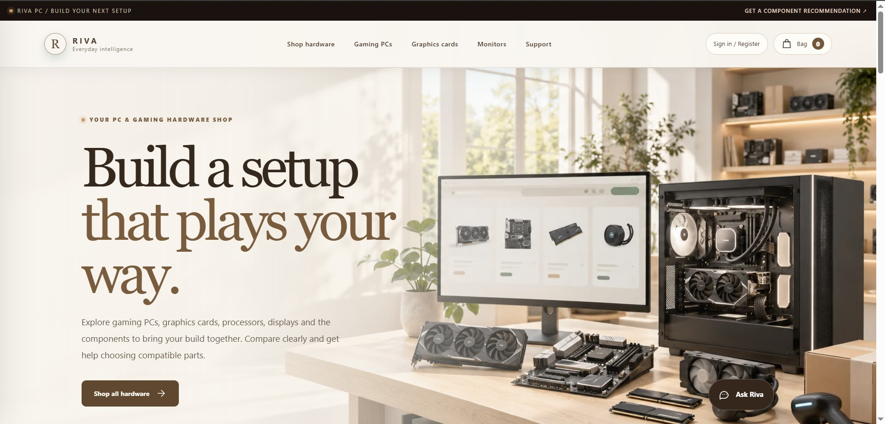</a><br><strong>Home | signed-out experience</strong><br>Storefront navigation, hardware categories, catalog entry point, and assistant access.</td>
    <td width="50%"><a href="docs/screenshots/homepage-hero.jpg">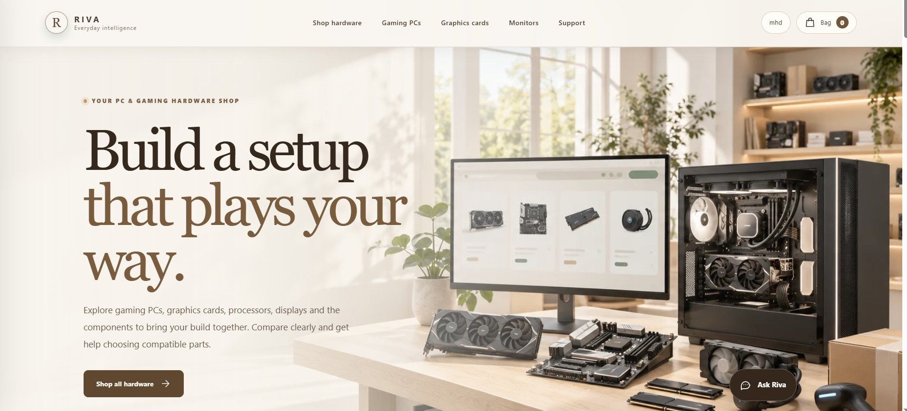</a><br><strong>Home | storefront hero</strong><br>Hero layout with featured hardware and shopping navigation.</td>
  </tr>
  <tr>
    <td width="50%"><a href="docs/screenshots/home-shopping-discovery.jpg">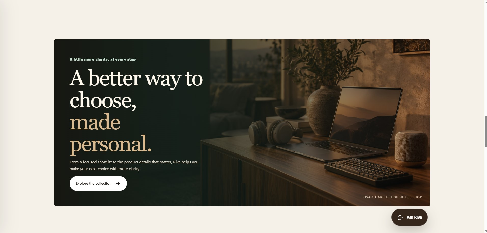</a><br><strong>Home | shopping discovery</strong><br>Editorial shopping entry point and product guidance.</td>
    <td width="50%"><a href="docs/screenshots/sign-in-and-registration.jpg">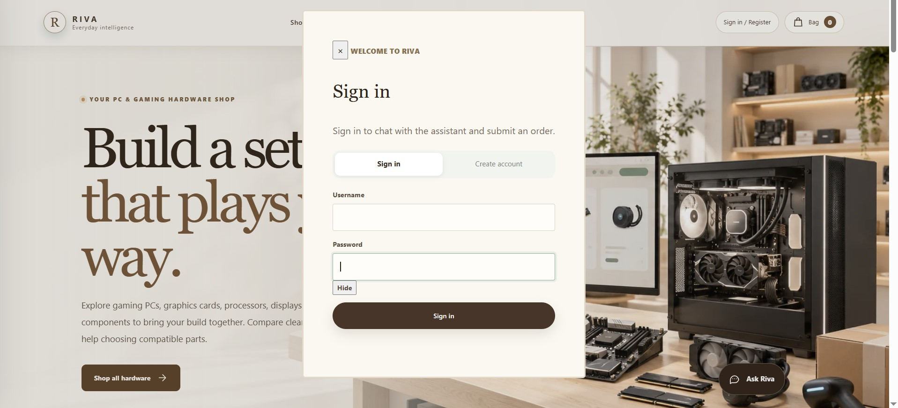</a><br><strong>Account access</strong><br>Sign-in and registration entry point for account-backed chat and checkout.</td>
  </tr>
  <tr>
    <td width="50%"><a href="docs/screenshots/catalog-graphics-cards.jpg">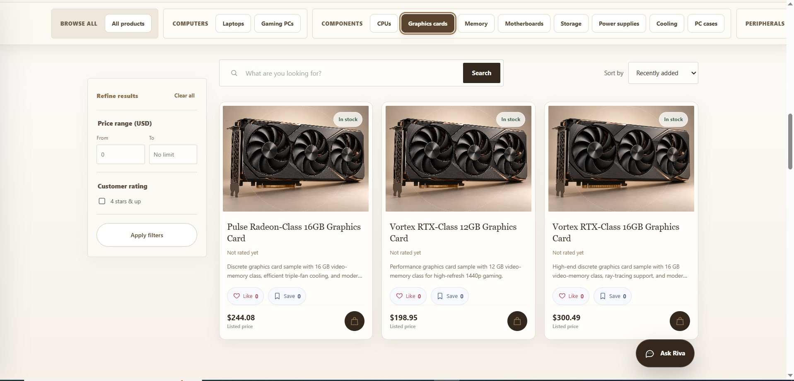</a><br><strong>Catalog | graphics cards</strong><br>Search, category navigation, price and rating filters, stock indicators, and product cards.</td>
    <td width="50%"><a href="docs/screenshots/catalog-laptops.jpg">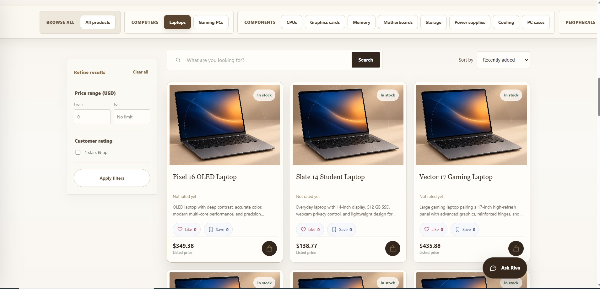</a><br><strong>Catalog | laptops</strong><br>Category browsing with sample laptop listings, prices, and availability.</td>
  </tr>
  <tr>
    <td width="50%"><a href="docs/screenshots/ai-product-finder.jpg">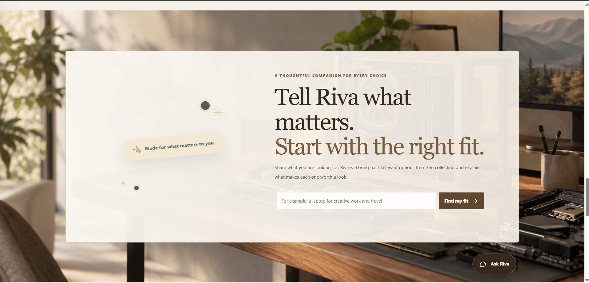</a><br><strong>AI product finder</strong><br>Shoppers describe their needs and ask Riva to find suitable items from the catalog.</td>
    <td width="50%"><a href="docs/screenshots/shopping-bag.jpg">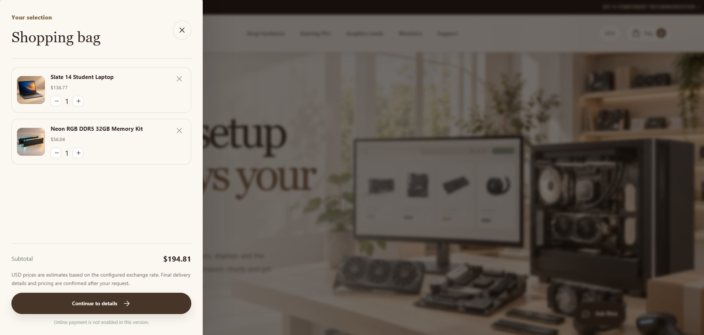</a><br><strong>Shopping bag</strong><br>Review selected products, quantities, subtotal, and the next checkout step.</td>
  </tr>
  <tr>
    <td width="50%"><a href="docs/screenshots/support-center-preview.jpg">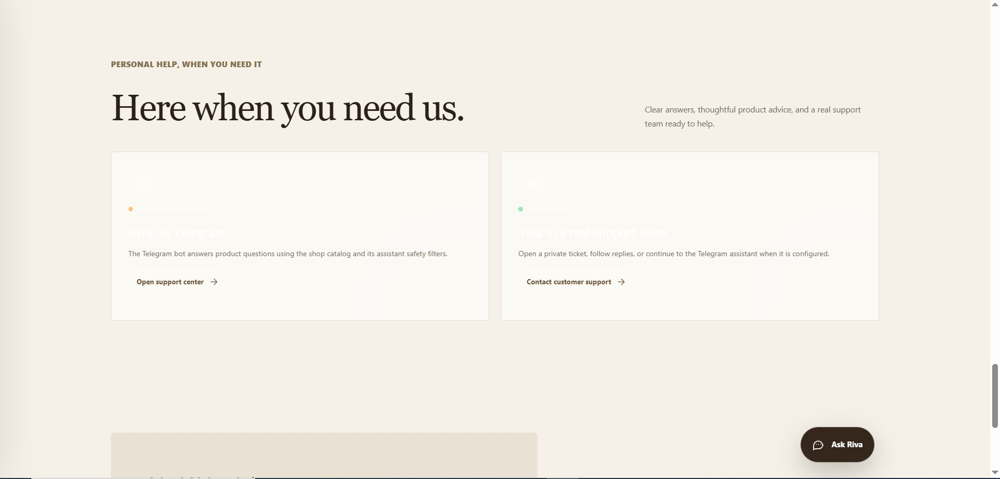</a><br><strong>Customer support</strong><br>Support-center entry point and optional Telegram assistant information.</td>
    <td width="50%"><a href="docs/screenshots/home-page-footer.jpg">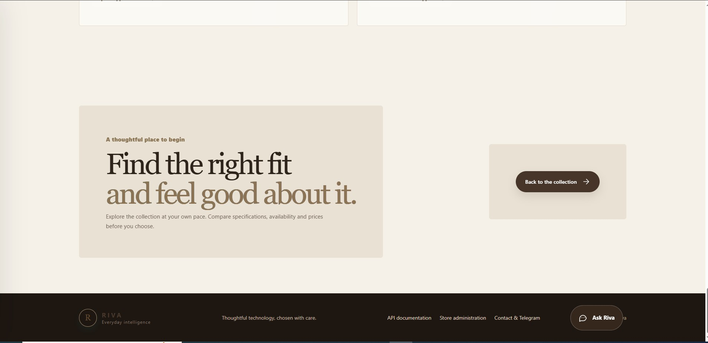</a><br><strong>Storefront footer</strong><br>Navigation to API documentation, administration, and contact options.</td>
  </tr>
</table>

The account dashboard and a completed assistant conversation are not included in this capture set. Add privacy-safe screenshots of those flows when available, using a dedicated demo account with no personal information.

## Product tour

| Area | What visitors can explore |
| --- | --- |
| Home | Editorial storefront, featured hardware, catalog entry points, and the embedded shopping assistant. |
| Catalog | Searchable and filterable products, categories, availability, sorting, and product cards. |
| Product detail | Product specifications, current listing information, recommendations, and add-to-cart actions. |
| AI shopping assistant | Catalog-aware conversations and budget-aware product discovery through a configured compatible language-model endpoint. |
| Recommendations | Query-based product matching, optional semantic retrieval, keyword fallback, and quality-event tracking. |
| Cart and checkout | Cart management, authenticated order creation, inventory reservation, idempotent checkout, and provider-backed payment integration. |
| Customer account | Private profile, order history, saved and liked products, payment records, and support requests. |
| Support center | Customer support ticket submission and status tracking; assistant-generated drafts are reviewed by staff before sending. |
| API and operations | OpenAPI/Swagger and ReDoc, health checks, staff-only reports, security events, and Django administration. |

## Why Riva

Riva connects product discovery to practical commerce workflows. Recommendations can use catalog embeddings when an OpenAI-compatible embeddings endpoint and Qdrant are configured; without them, the application falls back to database-backed keyword search. The assistant retrieves product context instead of acting as an unrestricted general-purpose agent. Product and checkout records remain in Django's relational database, while Redis and Celery handle asynchronous work.

The project also includes operational features often omitted from storefront demos: inventory reservations, checkout idempotency, payment webhook verification, exchange-rate provenance, backup checks, staff review for support replies, and health reporting. These features make Riva a useful foundation for evaluating an AI-assisted commerce product, not a claim that a deployment is automatically production-ready.

## Capabilities

- **Commerce:** product catalog, category and text filtering, product details, cart, authenticated orders, stock tracking, and account history.
- **Conversational discovery:** catalog-grounded chat, conversation IDs, prompt-injection input checks, and product-aware responses.
- **Recommendation pipeline:** semantic retrieval with Qdrant when configured, a database keyword fallback, stock and budget constraints, and privacy-conscious interaction events.
- **Payments:** Stripe integration hooks, signed and time-checked webhook processing, duplicate-event handling, and reservation expiry. Local mock checkout is only a development convenience and is disabled outside debug mode.
- **Customer support:** ticket intake, department routing, assistant-generated reply drafts, and an explicit staff approval action before outgoing email.
- **Staff operations:** scheduled audit summaries, catalog and sales checks, security/model monitoring, task run history, and Django admin views.
- **Data protection:** per-account data scoping, rate-limited authentication endpoints, model-call telemetry that excludes raw prompts and responses, and configurable backup retention and verification. Chat messages themselves are persisted as conversation history; review the retention policy before a public deployment.
- **Integrations:** OpenAI-compatible chat/embedding endpoints, Qdrant, Redis, Celery, Stripe, SMTP, optional object storage for backups, and Telegram webhook support.

## How the shopping assistant works

1. A signed-in shopper sends a product question or describes a build, use case, or budget in the web assistant or chat API. Catalog browsing and the recommendation endpoint can also be used without an account.
2. Riva normalizes the input and applies length and prompt-injection checks. Rejected requests produce a security event with a rule identifier and a SHA-256 fingerprint.
3. The catalog resolver identifies explicit hardware categories and budget hints. It prefers matching available, in-stock products; a configured budget filters candidates using the current audited exchange-rate quote in production.
4. For general product queries, Riva uses Qdrant semantic search when the embedding provider and vector index are configured. If semantic search is disabled, unavailable, or returns no usable products, database-backed keyword search is used.
5. Riva builds one model request from system instructions, recent conversation history, selected shopping-role guidance, and product excerpts marked as untrusted catalog data. A configured OpenAI-compatible chat model writes the response. Without provider credentials, the local demo returns an explicit catalog-match response instead of pretending a live model answered.
6. Chat messages are saved to the conversation and the response can include relevant product IDs and product-page links. The separate recommendations API returns ranked results and records a query fingerprint, search mode, counts, and selected product IDs for quality analysis.

The specialist names represent routing and role guidance inside the request workflow; they do not imply that every query triggers a separate autonomous model or tool call. Product availability, pricing, and compatibility should be confirmed against the current product record before purchase.

## IP address and privacy

The current Riva application code does not read the client's IP address, infer a location from it, store it in customer profiles, or return it from Riva APIs. Historical migrations mention a removed location field only to preserve the database migration history; the current model no longer has that field.

An internet-facing web service must receive network traffic, so the hosting provider, reverse proxy, firewall, or monitoring service may still see or record connection IP addresses in infrastructure logs. Riva cannot prevent those systems from observing the connection. For a public deployment, review the host's access-log and retention settings and avoid forwarding IP headers to application services unless a documented feature requires them.

## Architecture

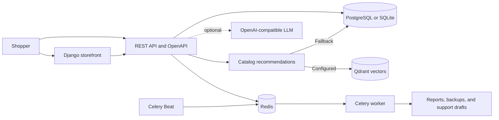

PostgreSQL is used by the supplied Docker Compose stack. SQLite is available for lightweight local development. Redis provides the task broker and production cache; Qdrant is optional and used for semantic catalog retrieval. The LLM endpoint is optional: without its configuration, semantic search is not enabled and keyword-based catalog search remains available.

## Technology stack

| Layer | Components | Role in Riva |
| --- | --- | --- |
| Web application | Python, Django, Django REST Framework | Storefront pages, domain logic, authentication, and JSON APIs. |
| Relational data | PostgreSQL in Compose; SQLite for lightweight development | Products, stock, accounts, orders, payment events, support tickets, and operational records. |
| Background processing | Celery, Redis, Celery Beat | Queued work, expiry sweeps, scheduled reports, backups, and optional rate refresh. |
| Product retrieval | Database keyword search; optional Qdrant vectors | Category-aware filtering and semantic product matching when embeddings are configured. |
| Language model | Optional OpenAI-compatible chat and embedding endpoints | Catalog-grounded conversational answers and vectors for semantic retrieval. |
| API documentation | OpenAPI via `drf-spectacular`, Swagger UI, and ReDoc | Inspect endpoint schemas and try API requests in development. |
| Delivery | Docker, Docker Compose, Gunicorn, WhiteNoise | Reproducible local stack, application serving, and static assets. |

The recommendation endpoint ranks catalog candidates and does not require a generative model. The conversational endpoint uses an authenticated conversation and calls the configured chat provider; when no provider is configured locally, Riva returns a clearly labeled deterministic demo response. Semantic search requires both the embedding provider configuration and a working Qdrant index.

## Repository map

| Path | Responsibility |
| --- | --- |
| `config/` | Django settings, URL routing, ASGI/WSGI entry points, and Celery application setup. |
| `apps/storefront/` | Customer-facing pages, templates, static UI, account flows, support pages, and storefront API endpoints. |
| `apps/products/` | Product and order domain models, inventory, serializers, and product APIs. |
| `apps/chatbot/` | Conversation API, provider client, input safety checks, catalog context, and Telegram webhook support. |
| `apps/recommendation/` | Product discovery API, ranking, search-mode tracking, and interaction events. |
| `apps/core/` | Payments, customer/account data, exchange-rate handling, health checks, shared permissions, and core services. |
| `apps/agents/` | Staff reports, support-response drafts, backup jobs, and task execution history. |
| `docs/screenshots/` | Real storefront screenshots embedded in this README. |
| `.github/workflows/` | Continuous-integration checks and container build workflow. |


## Run locally

### Docker Compose

1. Create `.env` from the example. Use the command for your shell:

   ```powershell
   # PowerShell
   Copy-Item .env.example .env
   ```

   ```cmd
   rem Windows Command Prompt
   copy .env.example .env
   ```

   ```sh
   # macOS or Linux
   cp .env.example .env
   ```

   Generate a development secret key with `python -c "import secrets; print(secrets.token_urlsafe(48))"`, put it in `.env`, and replace the sample database password with a unique local value. Never commit `.env`.

2. Start the application and its dependencies:

   ```powershell
   docker compose up --build -d
   docker compose exec web python manage.py migrate
   docker compose exec web python manage.py seed_demo_catalog
   ```

3. Open the storefront at `http://127.0.0.1:8011/`. API documentation is at `/api/docs/` and `/api/redoc/`. Create a staff administrator with:

   ```powershell
   docker compose exec web python manage.py createsuperuser
   ```

The demo catalog command creates sample computer hardware and inventory. Review and replace the sample listings and prices before processing real orders.

### Native development

Create and activate a virtual environment, then install Riva from the repository root. `pip install .` reads the project metadata and installs the application dependencies declared by this distribution.

```sh
python -m venv .venv
# macOS/Linux: source .venv/bin/activate
# PowerShell: .\.venv\Scripts\Activate.ps1
# Command Prompt: .venv\Scripts\activate.bat
python -m pip install --upgrade pip
python -m pip install .
```

Create `.env` using the command for your shell above, set a local secret, and use `DB_ENGINE=sqlite` for lightweight development. Then run:

```sh
python manage.py migrate
python manage.py seed_demo_catalog
python manage.py runserver
```

Start Redis and a Celery worker when exercising background tasks. Docker Compose is the complete reference environment with PostgreSQL, Redis, Qdrant, web, worker, and Beat services.

### Install by distribution name

The distribution is configured as `Riva_ai` in `pyproject.toml`. The equivalent local install command from a cloned repository is `python -m pip install .`. After a release is published to the Python Package Index (PyPI), users can install it by name with `python -m pip install Riva_ai`. Creating a GitHub repository does not publish a PyPI package; confirm the normalized name is available and publish a release before recommending the index command. Python package indexes normalize case and treat underscores and hyphens as equivalent, so `Riva_ai` is looked up as `riva-ai`.

To prepare a package release, install the build tools with `python -m pip install build twine`, build and inspect the wheel and source archive with `python -m build`, then publish only after confirming package-name ownership and reviewing the archive contents. Use PyPI Trusted Publishing or a protected upload token; never place publishing credentials in GitHub source files. The project currently has package metadata and builds locally, but has not been published to PyPI.

## Configure AI and semantic retrieval

Set the following values in the private runtime environment to use an OpenAI-compatible provider:

```dotenv
LLM_BASE_URL=
LLM_API_KEY=
LLM_MODEL=
EMBEDDING_MODEL=
EMBEDDING_DIMENSION=1536
```

The provider must implement `v1/chat/completions` and `v1/embeddings`. Use the embedding dimension expected by the selected model and configure `QDRANT_URL` and `QDRANT_COLLECTION`. Semantic retrieval is enabled only when the base URL, API key, and embedding model are present. Rebuild the catalog index after changing the provider or embedding model:

```powershell
docker compose exec web python manage.py reindex_catalog
```

Do not put provider keys in source files, screenshots, issue reports, or public deployment logs.

## API overview

| Endpoint | Purpose | Access |
| --- | --- | --- |
| `GET /api/storefront/products/` | Browse and filter the catalog | Public |
| `POST /api/register/` | Create an account | Public, rate limited |
| `POST /api/token/` and `POST /api/token/refresh/` | Issue and refresh JWTs | Public, rate limited |
| `GET /api/storefront/orders/` | List the signed-in customer's orders | Authenticated |
| `POST /api/storefront/orders/` | Create an order with an `Idempotency-Key` UUID | Authenticated |
| `GET /api/storefront/account/` | Read the current user's account summary | Authenticated |
| `GET/PATCH /api/storefront/account/profile/` | Read or update the current user's profile | Authenticated |
| `GET/POST /api/storefront/account/tickets/` | List or create support tickets for the signed-in customer | Authenticated |
| `GET /api/storefront/exchange-rate/` | Read the currently published exchange-rate quote | Public |
| `POST /api/storefront/payments/webhook/` | Process verified provider payment events | Provider signature required |
| `/api/products/` | Product API; write access is staff-restricted | Read access per API policy |
| `POST /api/chat/` | Send a shopping-assistant message | Authenticated, rate limited |
| `POST /api/recommendations/` | Request catalog recommendations | Public, rate limited |
| `POST /api/recommendations/events/` | Record recommendation interactions | Public, rate limited |
| `/api/admin/reports/` | Generate or read staff operational reports | Staff only |
| `POST /api/chat/telegram/webhook/` | Receive authenticated Telegram updates | Secret-header protected |
| `GET /api/health/` | Check configured application dependencies | Public health endpoint |
| `/api/docs/` and `/api/redoc/` | Browse generated OpenAPI documentation | Public |

Consult the generated API schema for request and response details. The endpoints and permissions in a deployed environment should be reviewed against the intended public-demo policy.

## Background jobs and data operations

Celery Beat schedules database backup, backup verification, exchange-rate refresh, and staff-report jobs. Schedule values are configurable through environment variables; the application defaults use UTC. The report workflow checks catalog/site health, sales, inventory, support routing, and model operations, and stores results for staff review. Unpaid orders are excluded from settled-revenue reporting.

Backups are compressed Django fixtures with SHA-256 sidecars and configurable retention. Optional object-storage copies support server-side encryption. A restore check loads a backup into an isolated temporary SQLite database. Backups may contain customer and order data: restrict access, define recovery objectives, and test restoration before relying on them.

The application stores prices in its configured shop currency and supports audited USD-to-Toman conversion for checkout quotes. Exchange-rate refresh requires a provider URL that returns a positive rate, an observation timestamp, and a source identifier. Production checkout is unavailable when a fresh audited rate cannot be obtained and unaudited fallback is disabled.

## Payments and checkout

The mock checkout never collects card data or charges money. It is disabled by default outside development; a disposable public demo may enable it only with both `DEMO_MODE=True` and `ALLOW_MOCK_PAYMENTS=True`. The checkout page clearly marks simulated payments. For real payments, use a separately configured payment provider and restricted test credentials; never enable Django debug mode on a public service.

For real payments, configure the provider credentials, webhook secret, HTTPS site URL, and a fresh audited exchange-rate source. The Stripe webhook validates its signature, event age, session, amount, and currency. Duplicate provider event IDs are ignored and expired checkout reservations are released. Never store card numbers, private keys, or seed phrases in Riva.

## Deployment and public demo

The repository includes a Docker image and a multi-service Compose stack intended as a reproducible deployment baseline. A public demo still needs a host that can run Django and the required database/cache/worker services, a configured public hostname, environment secrets, static-file handling, and a decision about whether AI and checkout are enabled. GitHub Pages cannot run this Django application. Follow the step-by-step [public demo deployment checklist](docs/DEMO_DEPLOYMENT.md) before advertising a live URL.

Before publishing a demo, set `DEBUG=False`, use a unique production `SECRET_KEY`, exact `ALLOWED_HOSTS`, HTTPS `CSRF_TRUSTED_ORIGINS`, secure cookies, PostgreSQL, shared Redis, and protected provider secrets. Configure trusted proxy headers only when the deployment proxy is controlled. Keep staff/admin operations protected and seed only disposable demonstration data. Do not use customer or personal records in a public demo.

No public demo URL is configured in this repository yet. Use the deploy button above or the [Render Blueprint](https://render.com/docs/blueprint-spec) to create your own instance, then add its real URL here only after the site is live and its public flows have been checked.

### Steps to publish the interactive demo

1. Push the reviewed source to the [`Riva_ai_shop` repository](https://github.com/Mhdjamadi1994/Riva_ai_shop) and confirm that the [CI workflow](https://github.com/Mhdjamadi1994/Riva_ai_shop/actions) passes.
2. Open the Render deploy button and review the plan and charges before applying the Blueprint. It creates a Django web service, PostgreSQL, Redis-compatible queue, Celery worker, and Celery Beat scheduler. Render's free web services can spin down, free Postgres expires after 30 days, and free compute is not offered for background workers; see the current [free-tier details](https://render.com/docs/free) and [pricing](https://render.com/pricing).
3. The included Blueprint sets `DEBUG=False`, generates a production secret, applies HTTPS-aware proxy settings, restricts database and queue access to the private network, migrates the database, and seeds sample products during deployment. It reads the generated hostname and HTTPS origin from Render. If you add a custom domain, update `ALLOWED_HOSTS`, `CSRF_TRUSTED_ORIGINS`, and `PUBLIC_SITE_URL` to match it.
4. The deployment deliberately enables the no-card demo payment simulator and uses a sample exchange-rate fallback only for simulated orders. It does not connect a real payment gateway. To demonstrate live AI, add `LLM_BASE_URL`, `LLM_API_KEY`, and `LLM_MODEL` in the host's private environment settings. For semantic product search, also configure the matching embedding model/dimension and a private Qdrant service, then run `python manage.py reindex_catalog`. Without these optional services, keyword search and a clearly labeled catalog-match assistant response remain available.
5. Support ticket drafts are processed by Celery; the demo email backend does not deliver messages. Database backup scheduling is disabled because the Blueprint does not configure durable object storage. Configure an email provider or backup storage separately before enabling those features.
6. After deployment, open the service's shell and create a private staff account with `python manage.py createsuperuser`. Do not put its credentials in the repository. Verify the health endpoint, registration, product browsing, chat, recommendations, cart, simulated checkout, support tickets, and staff tools using disposable test accounts.
7. Add the real public HTTPS URL and disclose which integrations are enabled in the Live demo line above. Do not advertise the Blueprint button as an already-running demo.

## Security and publication checklist

- `.env`, local databases, backups, archives, and development exports are excluded by `.gitignore` and `.dockerignore`.
- `.env.example` contains configuration names and sample values only; replace its local defaults in each deployment.
- Use GitHub secret scanning and a dedicated secret scanner before publishing. Rotate any credential that was ever committed, even if the commit was later amended.
- Review migrations and sample data to ensure that they contain no real customer records.
- Keep staff endpoints and Django admin protected; do not publish admin credentials or screenshots containing private records.
- Treat prompt-injection checks as one defensive layer, not a guarantee against every malicious input.
- Confirm licensing and source attribution for bundled product photography and dependencies before redistribution.

The project directory should be reviewed separately from Git's tracked-file list before publication. Ignore rules reduce accidental inclusion but do not remove sensitive files that were previously committed.

## Project quality and limitations

Riva provides a broad prototype covering storefront, API, assistant, recommendations, support, payments, and staff operations. Its practical quality depends on provider configuration, catalog quality, deployment hardening, monitoring, backups, and ongoing security review. A passing automated test suite is useful evidence but is not a security certification or a guarantee of production readiness. Product prices and stock in the seeded catalog are illustrative.

## Project checks

```powershell
python manage.py check
python manage.py test --noinput
```

GitHub Actions runs the project checks and builds the Docker image for pushes and pull requests. Run database migrations explicitly in deployment workflows and verify the health endpoint after each release.

## License

Riva AI is released under the MIT License; see [`LICENSE`](LICENSE). The license applies to this project code. Review licenses and attribution requirements for third-party dependencies and bundled images separately.
